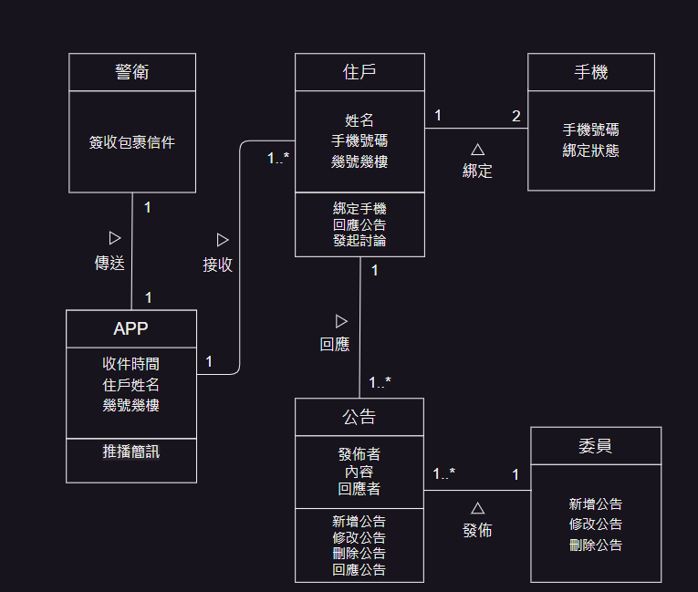
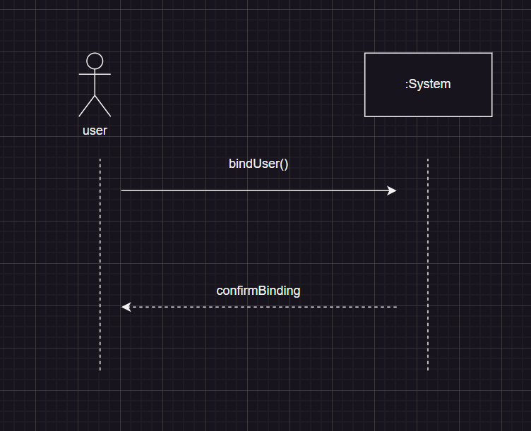
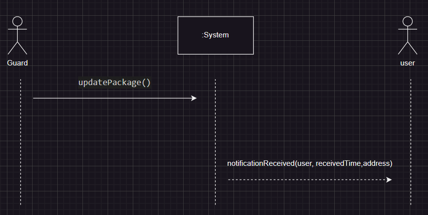

# 第4次作業-作業-HW4
>
>學號：111108116
> 
>姓名：吳亭誼
> 
>作業撰寫時間：30 (mins，包含程式撰寫時間)
> 
>最後撰寫文件日期：2024/06/09
>

本份文件包含以下主題：(至少需下面兩項，若是有多者可以自行新增)
- [x] 說明內容
- [x] 個人認為完成作業須具備觀念

## 說明程式與內容
 (a)初步類別圖
 

(b)
 
 合約1：bindUser()
 操作：bindUser(name,phoneNumber)
 交互參照：綁定住戶手機
 前置作業：住戶提供姓名、手機號碼綁定APP
 後製作業：與警衛確認完後於APP顯示綁定成功

 
 合約2：updatePackage()
 操作：notificationReceived(name,receivedTime,address)
 交互參照：包裹領取通知
 前置作業：警衛簽收包裹
 後製作業：包裹所屬人之住戶獲得APP推播簡訊，包含收件時間與幾號幾樓住戶

## 個人認為完成作業須具備觀念

參照topic 5、6繪製初步類別圖及系統循序圖，了解步驟和圖形物件基本使用概念後大概先畫框架出來